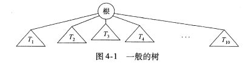
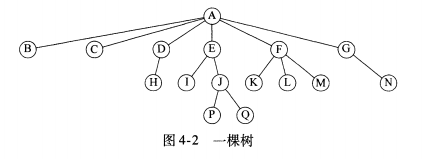

## 二叉树
    二叉查找树是两种库集合类TreeSet和TreeMap实现的基础。

### 相关概念
    定义树的一种自然的方式是递归的方式。
    一棵树是一些节点的集合。

    若不是空集，则树由称作根(root)的节点，以及多个非空的子树组成，这些子树的根都被来自root的一条有向边(edge)所连结。
    (例如：图 4-1)

    每个子树叫做根(root)的儿子，而root是每个子树的父亲(parent)。

    一个树是N个节点和N-1条边的集合，其中一个节点叫做根(root)。

 

    图 4-2的树中，节点A是根。节点F有一个父亲A，和儿子K、L、M。

    每一个节点可以有任意多个儿子，也可能是零个儿子。
    没有儿子(子节点)的节点叫做树叶(leaf)。
    例如：B、C、H、I、P、Q、K、L、M、N都是树叶

    具有相同的父亲的节点称为兄弟；
    因此，K、L、M是兄弟节点。

    从节点N(1)到N(k)的路径，定义为节点N(1)，N(2)，...，N(k)的一个序列。
    最小的N，即为最大N的父亲。

    这条路径的长为该路径上边的条数，即k-1。

    从每一个节点到它自己有一条长为0的路径。

    注意：在一棵树中从根到每个节点恰好存在一条路径。(？？没太明白)

    对于任意节点N(i)，N(i)的深度(depth)为从根(root)到N(i)的唯一的路径的长。
    因此，根(root)的深度为0。

    N(i)的高(height)是从N(i)到一片树叶的最长路径的长。
    因此，所有树叶的高都是0。

    一棵树的高等于它的根的高。

    对于图4-2中的树来说：
        E的深度为1;(从root到E)
        E的高度为2;(从E到Q或P)

        F的深度为1，高也是1。

        这棵树的高为3;

    一棵树的深度等于它的最深的树叶的深度；该深度总是等于这棵树的高。

    如果存在从N(1)到N(2)的一条路径，那么N(1)是N(2)的一位祖先，而N(2)是N(1)的一个后裔。
    如果"N(1) 不等于 N(2)"，那么N(1)是N(2)真祖先，而N(2)是N(1)的真后裔

## 二叉树

    二叉树(binary tree)是树的一种，其每个子节点不能多于两个。
    二叉树的一个性质是：一棵平均二叉树的深度要比节点个数N小得多，这个性质有时很重要。
    (图 4-11)
